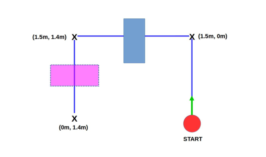

# Lab4 - Obstacle Avoidance

## 1 Overview
The objective of this lab is to design a set of controllers to make a robot drive
through a set of way points, given to you in a text file, in the presence of
unknown obstacles. Figure 1 shows a cartoon of the path that the robot will
follow. The blue box is in a known stationary position within the environment,
while the purple object will be added by an instructor during the demo. The
robot will use onboard odometry and dead reckoning to determine its global
position during the navigation. It will be assumed that the robot starts at
global position (0m, 0m) with orientation aligned with the x-axis.

<p>

</p>

  Figure 1: Cartoon of the experiment setup. The blue box is fixed in place while
the purple faded box will be placed by an instructor during the demo.

For this lab you can develop and test your code running roscore on your
computer. However, you must run roscore and all files onboard the robot for
the demonstration. To move folders from your computer to the robot, use the
scp (secure copy) command. For example,

```
  scp -r <Directory on your cpu to copy>
  burger@<ip-of-burger>:<Directory to copy to on robot>
```
We strongly encourage you to use all available resources to complete this
assignment. This includes looking at the sample code provided with the robot,
borrowing pieces of code from online tutorials, and talking to classmates. You
may discuss solutions and problem solve with others in the class, but this remains a team assignment and each team must submit their own solution. Multiple teams can not jointly write the same program and each submit a copy, this
will not be considered a valid submission.

## 2 Lab Instructions
Create a package called **TeamName_navigate_to_goal** (refer back to the ROS
tutorials from Lab 1 if needed). Useful dependencies include **rospy**,  **roscpp**, **sensor_msgs**, **std_msgs**, **nav_msgs**, and **geometry_msgs**. You can add as many
nodes as you like. An example structure would be:

**getObjectRange:** This node should detect the ranges and orientation of
obstacles. It should subscribe to the scan node and publish the vector pointing
from the robot to the nearest point on the object.

**Note**: You will have to do some filtering of the LIDAR data to determine what measurements of the 360 are useful. You may also
want to segment your readings to be able to discern two obstacles
apart from one another. You will only encounter one obstacle at a
time, but if your LIDAR sees the wall or a stray chair/other robot
you will want it’s object estimate to be robust. It is also important to remember that this data is with respect to the robot’s local
coordinate frame.

**goToGoal:** This node should subscribe to the odom node which determines
the robots global position from onboad sensors for you (using dead reckoning). It should also subscribe to the getObjectRange node to determine if there are any obstacles that need to be avoided.

This node should first read in the given goal locations from the wayPoints.txt file, or you can include them in your code some other way. You should then create several controllers that drive the robot through the sequence of given goal points without colliding with unknown obstacles. To receive full credit the robot must stop for 10 seconds within a 10cm radius of the first goal point, 15cm radius of the second goal point, and 20cm radius of the third goal point, the robot must not hit any obstacles, and the robot must reach the destination in under 2 minutes 30 seconds.

## 3 Possible Issues

1. Remember the onboard odometry and goal points are given in the same
global frame while the measurements are in the robot’s local frame. The
2package [tf2](http://wiki.ros.org/tf2) in ROS (http://wiki.ros.org/tf2) may be useful to transform coordinate frames if you want but is not necessary for this lab.

2. The Turtlebot3 has built in odometry which you are free to use. You can
access it by subscribing to the **/odom** topic. It relies on proper calibration beforehand which can mess up if you move the robot during its bringup. It is highly recommended to print out the robot’s estimated pose to make sure the odometry is correct and not drifting while the robot is stationary. If you find it is messed up it can be fixed by placing the robot on the floor and restarting the bringup.

3. The odometry node saves the current position of the robot and starts
where it left off. If you pick up the robot and restart your program to
run the course, the odometry given to the robot will be the position and
orientation the robot was last at before you picked it up. We have given
you a python script (RotationScript.py) which records the initial odometry
readings and subtracts them as an offset so your assumed starting position
is the origin with heading aligned with the x-axis. You may integrate this
into your project however you want.

4. The angular component of the odometry is represented by a quaternion
which should be used appropriately.

5. If you wish to create dead reckoning position updates yourself, or augment
the ones produced in the /odom topic, you can access the IMU and encoders through published topics /imu and /sensor state. More details can
be found at http://wiki.ros.org/turtlebot3_bringup#Published Topics.

## 4 Grading

You are allowed **5 attempts** to demo this to an instructor and will receive the best score of your attempts.

<p>
  
  | Criteria                                                           | Grades                                                     |
  | ------------------------------------------------------------------ | --------------------------------------------------------   |
  | Run the code onboard the robot                                     | 25%                                                        |
  | Drive within 10cm of the first goal point                          | 25%( e<sup>-stopped_distance_outside_of_goal_in_cm</sup> ) |
  | Drive within 15cm of the second goal point                         | 25%( e<sup>-stopped_distance_outside_of_goal_in_cm</sup> ) |
  | Drive within 20cm of the third goal point                          | 25%( e<sup>-stopped_distance_outside_of_goal_in_cm</sup> ) |
  | Each collision with an obstacle                                    | -5%                                                        |
  | Take more than 2 minutes, 30 seconds to reach the final goal point | -15%                                                       |

## Example Grade:
  
You run all your code on the robot. Your robot reaches the first goal point
within 10cm, hits the obstacles once but makes it within 20 cm of the secondgoal point, and then reaches the final goal point within 20cm. This is all done
within 2 minutes, 30 seconds. Your grade would be...
<p>
  
  grade = 25 − 5 + 25e<sup>-5/25</sup> − 25 + 25 + 25 <br> 
  &nbsp; &nbsp; &nbsp; &nbsp; &nbsp; = 25 − 5 + 20.5 + 25 + 25 <br>
  &nbsp; &nbsp; &nbsp; &nbsp; &nbsp; = 90.5 <br>  

## 5 Submission
  
You have two required submissions for this lab.
  
1 Your ROS package in a single zip file called Lab4_LastName1_LastName2.zip
uploaded on Canvas under Assignments–Lab4.

2 A live demonstration of your code to one of the instructors. This can be
done anytime before the due date at the top of this lab. Class will meet in
the lab room on the due date to allow everyone to demo their controllers.
If you demo before the due date you do not need to come attend class that
day.
